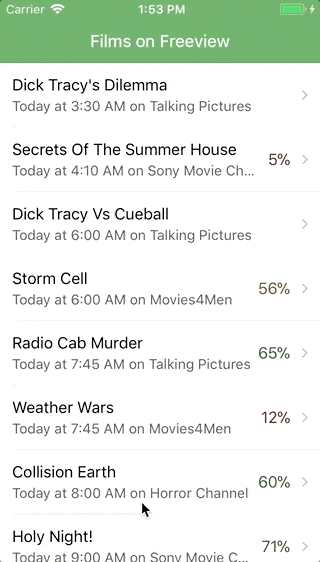

# Films Guide App

The films guide app is the second app we build on the course. It builds upon the basics introduced in the Counter app and introduces a few new concepts, including multi-screen navigation and retrieving data from an API.

## Wireframe

The following wireframe should be used as a guide when building the app.


## Requirements

The app should:

- Begin with a list screen, displaying a list of films showing the name, rating (if available) and next showtime. The list of films will be initially sourced from a local JSON file, but eventually will be fetched from an API.
- Allow a film to be tapped in the list, navigating to a detail view. This will display the following content:
  - Film name (in headerbar)
  - Film's poster image (if available)
  - Film release date (if available)
  - Film rating (if available)
  - List of all film's showtimes
  - Film synopsis
- The detail screen should include a button in the headerbar, which, when tapped, will open an in-app-browser screen to show the IMDB page for the film.
- The rating text should change colour depending on the rating of the film.
- The showtimes should be rendered as 'Today', 'Tomorrow' or '{day}' instead of the raw date.

## Suggested Approach

- Start by installing React Navigation and setting up the list-detail screens.
- Import the [films JSON data](assets/films.json) and use it to render the list screen.
- Implement the main content view in the detail screen (ignore the headerbar button for now).
- Migrate the app to use Redux. Initialise the store with the films JSON data.
- Use Redux Thunk to fetch the data from the films API instead: `https://filmsonfreeview.herokuapp.com/api/films`. While the list screen is loading the data, consider rendering an [ActivityIndicator](https://facebook.github.io/react-native/docs/activityindicator.html).
- Implement the headerbar button to show the film in the In-App Browser. Take a look at the extras section for the [navigation challenges](../../challenges/navigation.md) for more details on how to achieve this.
- Render out the showtime using the [moment](https://momentjs.com) library. In particular, use the `[moment(String)](http://momentjs.com/docs/#/parsing/string/)` function, and then call `[.calendar()](http://momentjs.com/docs/#/displaying/calendar-time/)` on the result. For `String`, pass in the showtime `startsAtDate` and `startsAtTime`, separated by a space. For example:

    ``` js
    moment('2018-03-22 17:11').calendar()
    ```

- Finish up by changing the rating text colour according to the rating value.

## Resources

You will find the following information helpful when developing the app.

- Headerbar colour: `#68aa63`
- Rating colours:
  - 60% or greater: `#265819`
  - 40-59%: `#71500f`
  - Less than 40%: `#7e2310`
- Fake films JSON data: [find it here](assets/films.json)
- The URL to the image on the detail screen should take the form `https://image.tmdb.org/t/p/original/<tmdbImageId>.jpg`, where `<tmdbImageId>` points to the image ID for that particular film.
- API endpoint: `https://filmsonfreeview.herokuapp.com/api/films`
- When rendering the detail view, consider that some of the data might not be available, and how this should impact the layout. For example, consider the following films from the static JSON file, and see [this folder](resources/) for examples of how the layout should adapt to the data:
  - *Legend*: includes release date but no rating
  - *Ted*: includes both release date and rating
  - *Scarlet Web*: includes rating only

## Completed App

The completed app should resemble the following:



The source code for the completed app can be found [here](https://github.com/studiozeffa/film-guide-app).

## Extras

If you manage to finish all of the above, you can find extra work [here](extras.md).